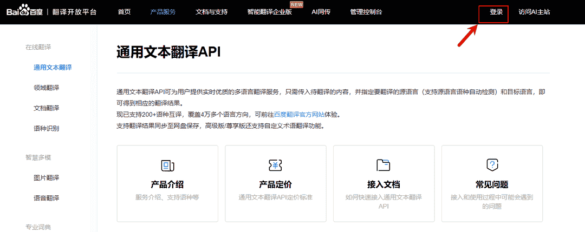
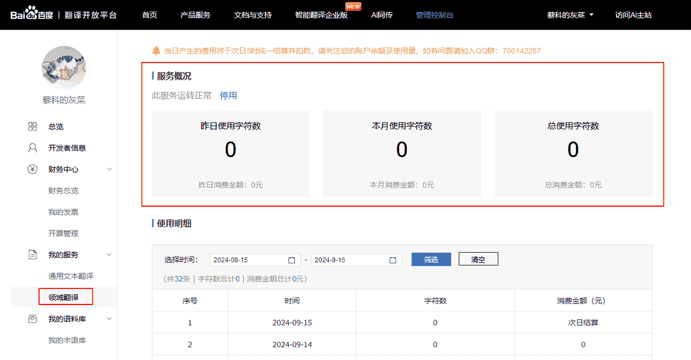
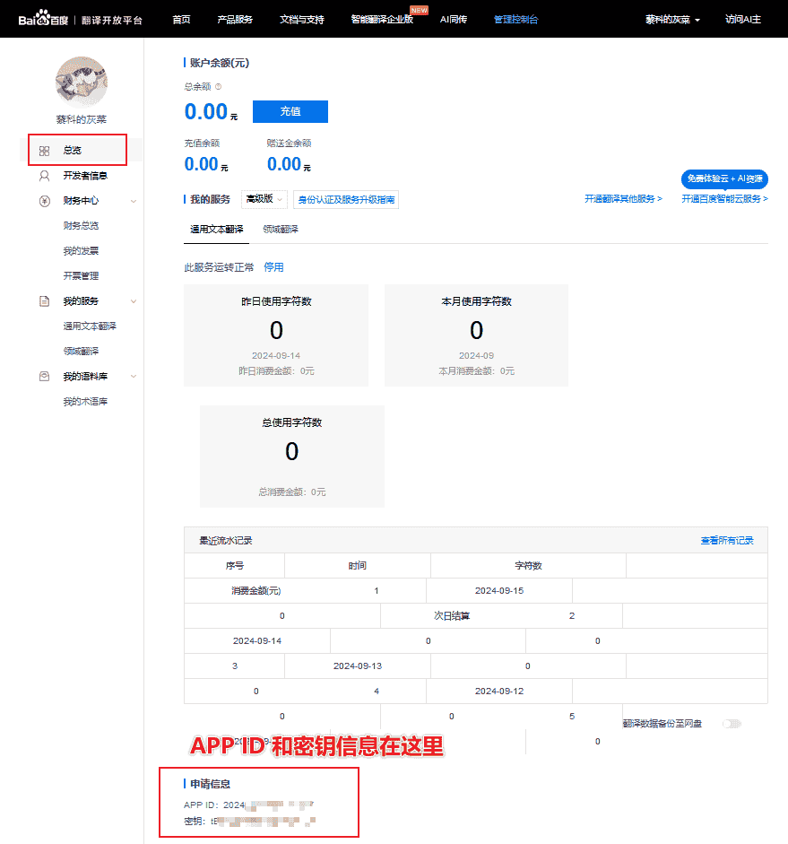
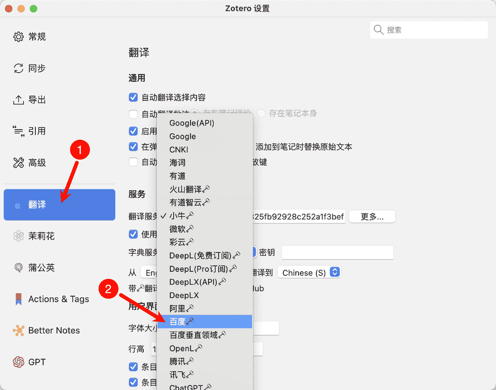
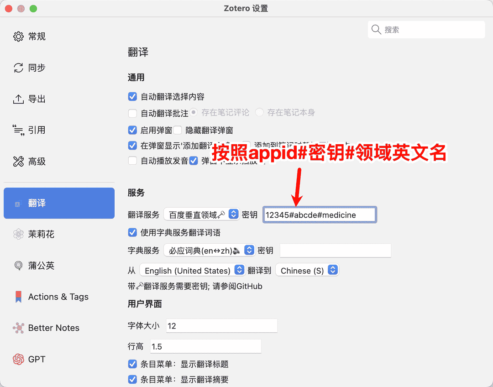
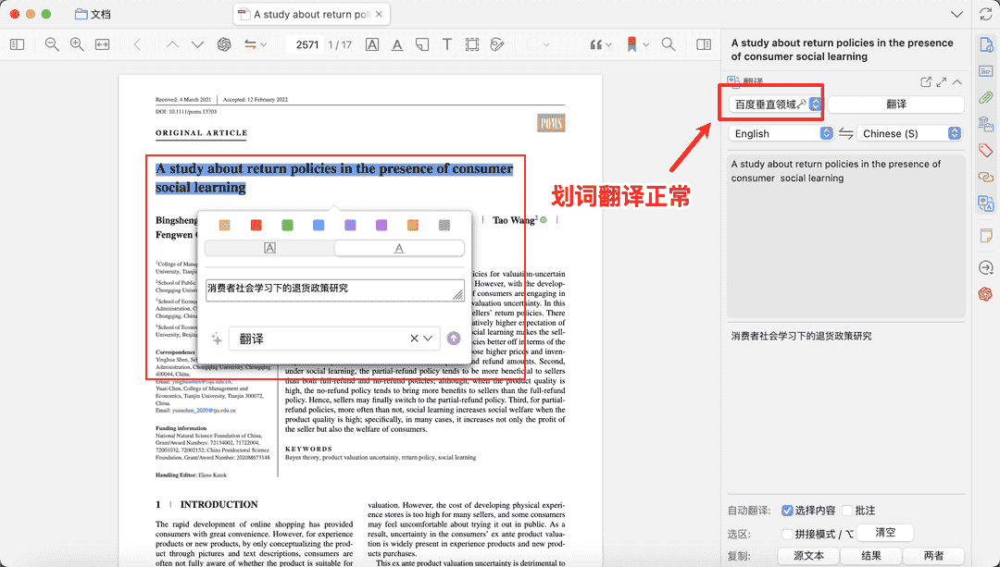

# 百度翻译接口申请和配置

百度翻译和垂直领域翻译免费额度

不过后面申请成功后的提示，高级版是每月 100W 字符

## 1. 账号注册

直接访问 [https://fanyi-api.baidu.com/product/11](https://fanyi-api.baidu.com/product/11)，如果未登录，点击右上角登录。没百度账号的同学，就直接新注册一个。

网页上直接列出了通用文本翻译和领域翻译，这两个就是常说的百度翻译和百度垂直领域翻译。这两个的区别是

- 免费额度不同，垂直领域相比通用文本翻译免费额度少，每月只有 50W
- 精细度不同。为了提升特定领域机器翻译的准确度，百度翻译针对多个垂直领域模型进行了优化，特定领域术语翻译相较于通用文本翻译 API 结果更为准确，句式更加符合该行业特点。

目前已开通科技电子、水利机械、生物医药等 3 个垂直领域，不过只有生物医药支持中英互译，剩下两个只支持中文到英文。建议生物医药相关专业的同学，可以试试使用垂直领域翻译接口。

访问 [https://fanyi-api.baidu.com/product/11](https://fanyi-api.baidu.com/product/11)，直接点击下方立即使用

点击之后可能出现验证（手机或实名制认证），请按照说明进行验证，提升免费额度。

然后需要注册成为百度翻译开发者，请选择个人开发者，并如实填下方表格中的信息。

选择下方高级版，每月 100W 免费额度。

## 2. 百度翻译（通用文本翻译）接口申请

访问 [https://fanyi-api.baidu.com/choose](https://fanyi-api.baidu.com/choose) ，选择通用文本翻译，点下一步

应用名称是必填的，其他随意写。最后点击提交申请。

上图是开通成功后的页面。

## 3. 百度垂直领域（领域翻译）接口申请

打开这个网页 [https://fanyi-api.baidu.com/choose](https://fanyi-api.baidu.com/choose)，选择领域翻译，点下一步

[https://fanyi-api.baidu.com/api/trans/product/desktop?req=field](https://fanyi-api.baidu.com/api/trans/product/desktop?req=field) 垂直领域的后台界面，上面有对应的使用明细。

## 4. 接口密钥查询

打开 [https://fanyi-api.baidu.com/api/trans/product/desktop](https://fanyi-api.baidu.com/api/trans/product/desktop)，可以在最下面看到配置使用的 APP ID 和密钥。

垂直领域翻译还需要一个领域参数，不过电子科技领域和水利机械领域只支持中文到英文，只有生物医药领域支持中英互译。建议相关专业的同学添加该参数

这里假设我申请到的 APP ID 为 12345，密钥为 abcde，选择生物医药领域为 medicine。介绍如何在 Zotero 翻译插件中设置。

### 4.1 百度翻译设置

提示窗口点 OK

这里填入 12345#abcde

### 4.2 百度垂直领域（领域翻译）设置

密钥处填入 12345#abcde#medicine

## 5. 接口测试

这里以百度垂直领域引擎为例进行测试，在 Zotero 中打开一篇英文 PDF，划词翻译，如下图正常翻译，就说明配置正常。

